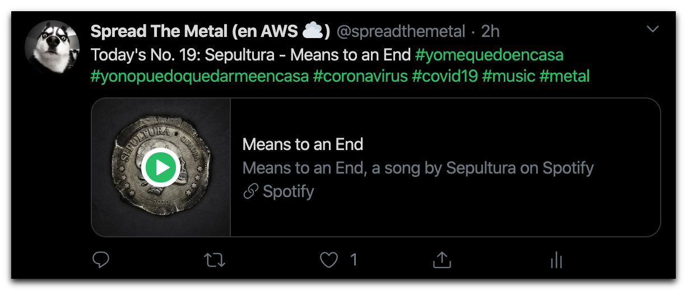

# Spread The Metal

Spread The Metal es un bot que publica canciones de distintos subgéneros de rock y de metal en la cuenta de [Twitter](https://twitter.com/spreadthemetal) del mismo nombre. Lo hace de forma automática y con una cadencia de una hora: cada minuto 1 de cada hora del día se publica una nueva canción.



## Cómo usar

Spread The Metal es una función [AWS Lambda](https://aws.amazon.com/lambda/) desarrollada en [Go](https://golang.org/). Debes tener instalado este lenguaje de programación en tu sistema para ejecutar los pasos que se proponen más abajo.

### Compilación y empaquetado

Lo primero que debemos hacer clonar este repositorio:

```bash
$ git clone https://github.com/vermicida/spread-the-metal.git
```

Con el código de la aplicación se distribuye un Makefile con varios targets que nos ayudarán con las siguientes tareas. Vamos a usar el primero de ellos para descargar las dependencias:

```bash
$ make deps
```

En este punto ya podemos compilar y empaquetar la aplicación. AWS Lambda espera el código de la función empaquetado en un documento zip, y es justo lo que hace el siguiente comando:

```bash
$ make dist
```

Al ejecutarlo, se compila el código y se comprime el binario resultante, dejando el resultado en `dist/function.zip`.

### Publicación

TBD
